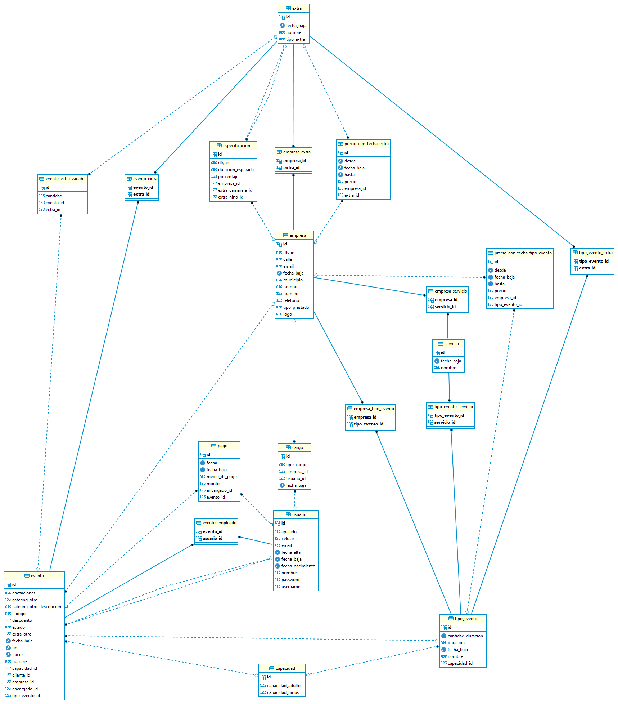

# 📒 Agendaza (BACK-END) - Sistema de Gestión para Salones de Eventos

Agendaza es un sistema integral para la gestión de eventos en salones. Facilita la administración de reservas, clientes, catering, servicios adicionales y mucho más.

[](https://github.com/Estonian-Port/agendaza-backend/tags)
[](https://github.com/Estonian-Port/agendaza-backend/actions)
[](https://codecov.io/gh/Estonian-Port/agendaza-backend)

---

## ✨ Características

- Calendario con los eventos registrados
- Gestión de clientes y reservas
- Administración de servicios, catering y extras
- Seguimiento de pagos y contratos
- Reportes e informes por evento

---

## 🗺️ Modelo de Entidad-Relación



---

## 🚀 Estado actual

Versión **1.1.0** — En desarrollo activo.  
Se encuentra implementado nuevos comprobantes, mejorar jerarquía en servicios, extras y clausulas. Para su reutilizacion con otras empresas.

---

## 🛠️ Tecnologías utilizadas

- Backend: Kotlin + Spring Boot
- Frontend: Angular + Bootstrap
- Base de datos: PostgreSQL
- Orquestación: Docker + Docker Compose (Proximamente)

---

## 🧪 Tests y cobertura

Los tests unitarios se ejecutan automáticamente en cada push y pull request mediante GitHub Actions. La cobertura se reporta a Codecov.

```bash
# Correr tests y generar reporte de cobertura localmente
./gradlew test jacocoTestReport

# El reporte HTML queda disponible en:
# build/reports/jacoco/test/html/index.html
```

Para contribuir, asegurate de que los tests existentes pasen y agregá tests para cualquier lógica nueva.

---

## 👥 Desarrollado por

Este proyecto fue desarrollado por **Estonian Port**.  
Visitanos en 👉 [https://estonian-port.github.io/estonianport-landingpage/](https://estonian-port.github.io/estonianport-landingpage/)