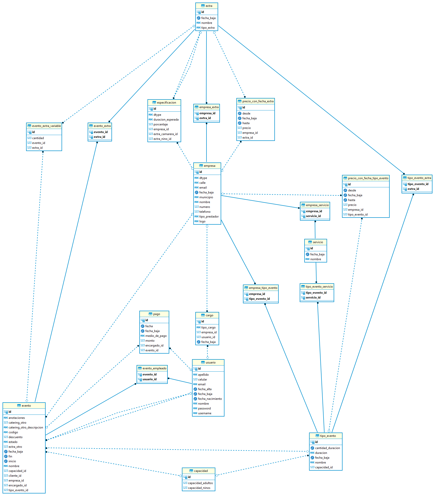

# 📒 Agendaza (BACK-END) - Sistema de Gestión para Salones de Eventos

Agendaza es un sistema integral para la gestión de eventos en salones. Facilita la administración de reservas, clientes, catering, servicios adicionales y mucho más.

---

## 👥 Desarrollado por

Este proyecto fue desarrollado por **Estonian Port**.  
Visitanos en 👉 [https://estonianport.com.ar](https://estonianport.com.ar)

---

## ✨ Características

- Calendario con los eventos registrados
- Gestión de clientes y reservas
- Administración de servicios, catering y extras
- Seguimiento de pagos y contratos
- Reportes e informes por evento

---

## 🛠️ Tecnologías utilizadas

- Backend: Kotlin + Spring Boot
- Base de datos: PostgreSQL
- Orquestación: Docker

---

## 🗺️ Modelo de Entidad-Relación

